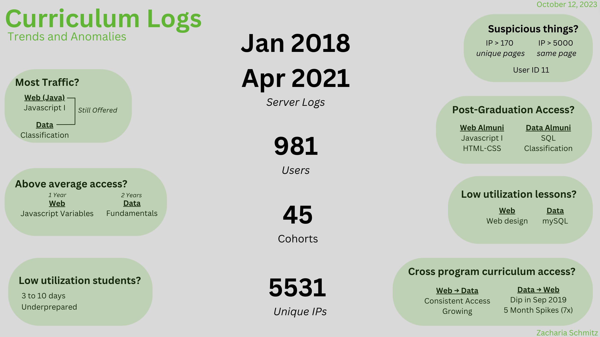
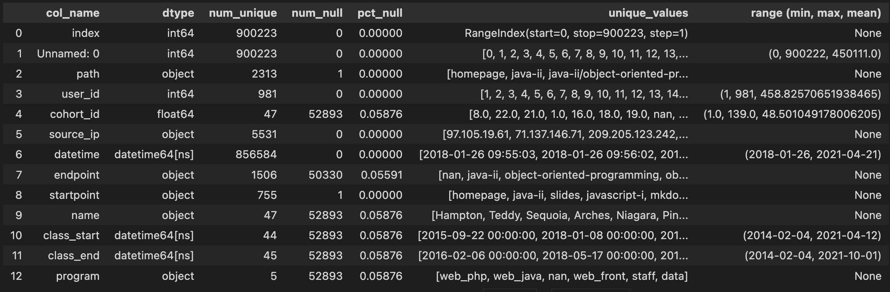

 

# Evaluating Curriculum Access Logs

---
 

--- 

#### Project Plan:

*(Jump To)*

[Project Overview](#overview)

[Data Acquisition](#acquire)

[Preparation](#preparation-steps)

[Questions and Answers](#questions-and-answers)

---

 

## Overview

<b> We're looking to answer a simulated email from someone (superior or colleague?) where they asked several questions regarding some server logs that were in a .txt file.</b> 

<i>All critical information has been anonymized.</i>
 
 

---

 

### Project Description

Email to me:

> Hello,
> 
> 
> I have some questions for you that I need to be answered before the board meeting Thursday afternoon. I need to be able to speak to the following 
> questions. I also need a single slide that I can incorporate into my existing presentation (Google Slides) that summarizes the most important points My questions are listed below; however, if you discover anything else important that I didn’t think to ask, please include that as well.
> 
> 
> 1. Which lesson appears to attract the most traffic consistently across cohorts (per program)?
>
> 2. Is there a cohort that referred to a lesson significantly more than other cohorts seemed to gloss over?
>
> 3. Are there students who, when active, hardly access the curriculum? If so, what information do you have about these students?
>
> 4. Is there any suspicious activity, such as users/machines/etc accessing the curriculum who shouldn’t be? Does it appear that any web-scraping is
> happening? Are there any suspicious IP addresses?
>
> 5. At some point in 2019, the ability for students and alumni to access both curriculums (web dev to ds, ds to web dev) should have been shut off. Do you see any evidence of that happening? Did it happen before?
>
> 6. What topics are grads continuing to reference after graduation and into their jobs (for each program)?
>
> 7. Which lessons are least accessed?
>
> 8. Anything else I should be aware of?
>
> 
> Thank you.  

### Initial Thoughts/Hypothesis

- Codeup offers 4 different programs. Differentiating between the 4 could be challenging.

- I know alumni retain access to curriculum. How quickly do they pull access from students that withdraw from the course? Could they be scraping the curriculum on their way out?

- Did any data science students scrape from web or vice versa?
 
 

---

 

## Acquire

We combined that .txt file with information pulled from the SQL database regarding cohort information.

The combined file is `'curriculum_access.csv'`.

Each row represents a unique index, which is accessing the curriculum.
 
 

---

 

### Data Dictionary:

 

| Column | Definition |
|--------|-----------|
|path| The full path that the user accessed |
|user_id| The user ID that was signed in to access the curriculum |
|cohort_id| A numerical representation of the cohort. In order, but has large gaps|
|source_ip| The IP address of the accessing device 97.105.19.X is Codeup's network|
|datetime| The date and time when the access occurred |
|endpoint| The last point in the path |
|startpoint| The first point in the path |
|name| The cohort name |
|class_start| The date the class started |
|class_end| The date the class graduated |
|program| The type of program at Codeup |

 

 

---

 

## Preparation Steps

### What we did:

- <b>With the Cohort information from SQL:</b>

    - Mapped all of the program IDs to their cohort type
    
        - 1 = web development PHP (Hypertext Preprocessor)
        - 2 = web development Java
        - 3 = data science
        - 4 = web development front end only
        - Cohort ID number 28 was Staff

   

- <b>With the logs fill from the original email:</b>

    - Combined the date and time into one date time column
    - Renamed the endpoint column to path
    - Created an endpoint column from the last part of path
    - Created a startpoint from the beginning of path
    - Replaced "/" values in path to be "homepage"
 
 

---

 

## Questions and Answers

 

--- 

 
 
**1. Which lesson appears to attract the most traffic consistently across cohorts (per program)?**

- Top Web Dev (PHP) Lesson: Javascript I

- Top Web Dev (Java) Lesson: Javascript I

- Top Web Dev (Front End) Lesson: HTML-CSS
 
- Top Web Dev (Data) Lesson: Classification

 

--- 

 
 
**2. Is there a cohort that referred to a lesson significantly more than other cohorts seemed to gloss over?**

- In recent web classes, there seems to be more of a focus on Javascript I variables

- In recent data classes, there is a larger focus on fundamentals.

 

--- 

 
 
**3. Are there students who, when active, hardly access the curriculum? If so, what information do you have about these students?**

- Many students stopped accessing around 3 to 5 days in. I'd assume they weren't prepared and dropped out. Better preparation could be looked into.

 

--- 

 
 
**4. Is there any suspicious activity, such as users/machines/etc accessing the curriculum who shouldn’t be? Does it appear that any web-scraping is happening? Are there any suspicious IP addresses?**

- User ID 11 is now staff and was a former student. They should be given a new ID.

- Some IP addresses have hit the same page over 5000 times. This could be looked into for potential denial of service (DOS) intent.

- Many IP addresses have visited over 170 unique pages. The average is about 12 pages. This could be looked into for web scraping.

 

--- 

 
 
**5. At some point in 2019, the ability for students and alumni to access both curriculums (web dev to ds, ds to web dev) should have been shut off. Do you see any evidence of that happening? Did it happen before?**

- While there is a significant dip in data science users accessing the web curriculum in 9/2019, there is a large jump every 5 months where access goes up 7 times from the month prior. This could indicate someone offloading the curriculum.

- It looks like the web students have had continuous access to the data science curriculum and hits are continuously rising.

 

--- 

 
 
**6. What topics are grads continuing to reference after graduation and into their jobs (for each program)?**

- Web development alumni appear to reference back to Javascript I and HTML-CSS after graduation.

- Data alumni appear to reference back to SQL and Classification after graduation.

 

--- 

 
 
**7. Which lessons are least accessed?**

- For web dev, web-design appears to be the least accessed lesson.

- Oddly enough, for data, the mySQL seems to be one of the least accessed. This may be why alumni are referencing back to it. 

 
 

---

 

## How to Reproduce:

REQUIRED LIBRARIES:

- numpy
- matplotlib

1. Clone this repo.

2. Run the notebook.

 
 

---

 

### **Recommendations**

- With all the nulls in cohort ID and they have a user ID, my impression is they are supposed to have access. Make cohort ID a required entry when the account is initialized.

- Assign staff a new user ID even if they are former students.

- Possibly look into why so many students are dropping from web dev in the first week. Potentially work on better financial and/or academic preparedness on onboarding.

- Possibly look into high volume unique page access.

- Possibly look into high volume single page access.

- Look further into cross program curriculum access.

[Back To Top](#evaluating-curriculum-access-logs)